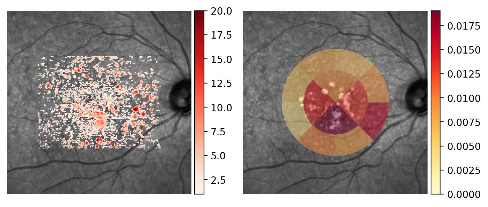
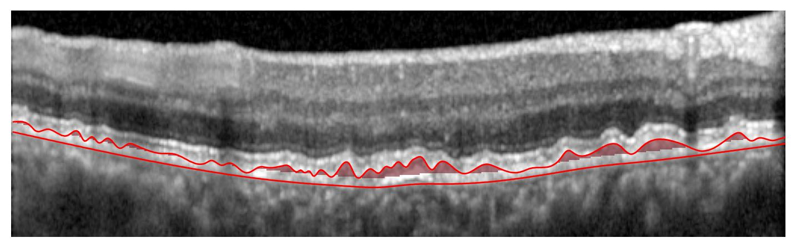

# eyepy

[](https://badge.fury.io/py/eyepie)
[](https://zenodo.org/badge/latestdoi/292547201)


This package is under active development and things might change without
backwards compatibility. If you want to use eyepy in your project make sure to
pin the version in your project requirements.


## Features

* Import HEYEY XML and VOL exports
* Import B-Scans from a folder
* Import public [AMD Dataset from Duke University](https://people.duke.edu/~sf59/RPEDC_Ophth_2013_dataset.htm)
* Import data of the [RETOUCH Challenge](https://retouch.grand-challenge.org/).
* Compute Drusen voxel annotation from BM and RPE layer segmentations
* Quantify voxel annotations on a customizable circular grid
* Plot annotated localizer
* Plot annotated B-scans
* Save and load EyeVolume objects

## Getting Started

### Installation
To install the latest version of eyepy run `pip install -U eyepie`. It is `eyepie` and not `eyepy` for installation with pip.

### Import Data
When you don't hava a supported OCT volume at hand you can check out our sample dataset to get familiar with `eyepy`.
```python
import eyepy as ep
# Import HEYEX XML export
ev = ep.data.load("drusen_patient")
```

`eyepy` currently supports the HEYEX XML and VOL export format. Support for additional formats is easy to implement.

```python
import eyepy as ep
# Import HEYEX XML export
ev = ep.import_heyex_xml("path/to/folder")
# Import HEYEX VOL export
ev = ep.import_heyex_vol("path/to/file.vol")
```

When only B-scans exist in a folder `eyepy` might still be able to import them. B-scans are expected to be ordered and distributed with equal distance on a quadratic area.
```python
import eyepy as ep
# Import B-scans from folder
ev = ep.import_bscan_folder("path/to/folder")
```

Public OCT datasets often have their own data formats. `eyepy` can already import volumes from two of the biggest OCT datasets.
```python
import eyepy as ep
# Import DUKE volume
ev = ep.import_duke_mat("path/to/volume.mat")
# Import RETOUCH volume
ev = ep.import_retouch("path/to/folder")
```

### The EyeVolume Object
When `eyepy` imports OCT data, it always returns an EyeVolume object. This object provides a unified interface to data imported from various sources.

You can use this object to perform common actions on the OCT volume such as:

+ Access Meta information from the loaded data if available `ev.meta`
+ Access an associated localizer image `ev.localizer`. When no localizer image is available `eyepy` generates one using a mean projection.
+ Access associated layer voxel and A-scan annotations
+ Plot annotated localizer image associated to the volume `ev.plot()`
+ Iterate over the volume to retrieve EyeBscan objects `for bscan in ev:`

### Compute Drusen and Quantify
Here we compute and quantify drusen for our sample data which has manual layer annotations for BM and RPE.

In the resulting plot on the left, the scale is the drusen height in voxel and on the right, the drusen volume in mm³

```python
import matplotlib.pyplot as plt
import eyepy as ep

# Import example data
ev = ep.data.load("drusen_patient")
drusen_map = ep.drusen(ev.layers["RPE"], ev.layers["BM"], ev.shape, minimum_height=2)
ev.add_voxel_annotation(drusen_map, name="drusen")

fig, axes = plt.subplots(1, 2, figsize=(5, 10))

# Configure quantification grid for drusen quantification
ev.volume_maps["drusen"].radii = [1.5, 2.5]
ev.volume_maps["drusen"].n_sectors = [4, 8]
ev.volume_maps["drusen"].offsets = [0, 45]

# Plot drusen projection and quantification
ev.plot(ax=axes[0], projections=["drusen"])
ev.plot(ax=axes[1], quantification="drusen")
axes[0].axis("off")
axes[1].axis("off")
```


To access the quantification as a dictionary use `ev.volume_maps["drusen"].quantification`

### Interact with individual B-scans
If you index into an EyeVolume object you get EyeBscan objects.

```python
import numpy as np

fig, ax = plt.subplots(1,1, figsize=(9,3))
bscan = ev[40]
bscan.plot(layers=["BM", "RPE"], areas=["drusen"], region=np.s_[150:300, :], ax=ax)
ax.axis("off")
```



# Related Projects:

+ [OCT-Converter](https://github.com/marksgraham/OCT-Converter): Extract raw optical coherence tomography (OCT) and fundus data from proprietary file formats. (.fds/.fda/.e2e/.img/.oct/.dcm)
+ [eyelab](https://github.com/MedVisBonn/eyelab): A GUI for annotation of OCT data based on eyepy
