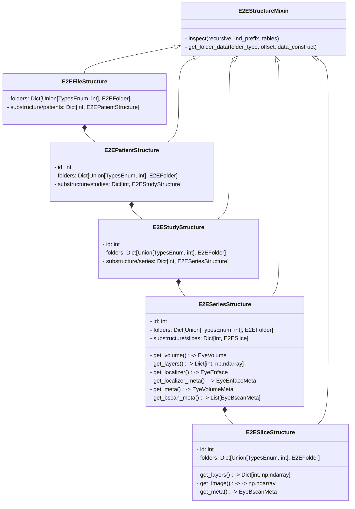

# Heidelberg Engineering E2E Format

Missing documentation of the Heidelberg E2E format has caused frustration by many working with OCT data and several projects tried to make the data accessible. Here you learn how to conveniently access data from E2E files using our [`HeE2eReader`][eyepy.io.he.e2e_reader.HeE2eReader] and what we know about the format.

## Get to know your data

One thing that makes it especially difficult to read data from E2E files is that E2E is a general container format that can contain 0 or more instances of different kinds of data. If you are interested how the data is stored you might want to continue [here](he_e2e_structures/he_e2e_structure_doc.md).

For most users it is probably enough to print the [`HeE2eReader`][eyepy.io.he.e2e_reader.HeE2eReader] object to get an overview of Patients, Studies and Series stored in the file.

```python title="Print E2E file overview"
from eyepy.io import HeE2eReader
print(HeE2eReader("filename.E2E")) # (1)
```

1.  Printing an HeE2eReader results in someting similar to this:

    ```text
    E2EFile


        E2EPatient(321)


        E2EStudy(1234)
        Device: Heidelberg Retina Angiograph - Studyname: NAME

            E2ESeries(50001) - Laterality: OD - B-scans: 241
            Structure: Retina - Scanpattern: OCT ART Volume - Oct Modality: OCT - Enface Modality: IR

            E2ESeries(50002) - Laterality: OD - B-scans: 25
            Structure: Retina - Scanpattern: OCT ART Volume - Oct Modality: OCT - Enface Modality: IR
    ```

## Access data that can be parsed to [`EyeVolume`][eyepy.core.EyeVolume] objects

The [`HeE2eReader`][eyepy.io.he.e2e_reader.HeE2eReader] provides a convenient interface to access data stored in E2E files. Assuming that your E2E file contains one or more OCT volumes you can parse the volumes to [`EyeVolume`][eyepy.core.EyeVolume] objects using the following code:

```python
from eyepy.io import HeE2eReader

with HeE2eReader("filename.E2E") as e2e_reader: # (1)
    volumes = e2e_reader.volume

with HeE2eReader("filename.E2E", single=True) as e2e_reader: # (2)
    volume = e2e_reader.volume
```

1.  `e2e_reader.volume` returns `List[EyeVolume]`
2.  `e2e_reader.volume` returns the first Series as `EyeVolume` object

!!! Warning Limitations of EyeVolume objects created from E2E files
    + Currently we can not read scale Information for the localizer images as well as the x-scale of the B-scans. Hence quantifications can not be transformed to metric units.
    + Also we know that in the E2E file B-scans are not registered with each other. This B-scan registration information has also not been found yet. This might cause problems when downstream analysis expects B-scans to be registered.

    If you know how to read this information from the E2E file, please let us know by opening an [issue](https://github.com/MedVisBonn/eyepy/issues)

## Access other data stored in E2E files

Not everything stored in an E2E file is accessible through parsing to [`EyeVolume`][eyepy.core.EyeVolume] objects. If you are interested in accessing other data stored in the E2E file, you can use the file hierarchy created by the [`HeE2eReader`][eyepy.io.he.e2e_reader.HeE2eReader]. The structure of the build hieararchy is shown in the [diagram](#e2e-hierarchie) below. The file hierarchy can be accessed through the `file_hierarchy` attribute of the [`HeE2eReader`][eyepy.io.he.e2e_reader.HeE2eReader] object. You can either traverse the hierarchy level by level or access all elements of a specific level at once using one of the following attributes:

+ `e2e_reader.patients` returns a list of all [`E2EPatientStructure`][eyepy.io.he.e2e_reader.E2EPatientStructure] objects
+ `e2e_reader.studies` returns a list of all [`E2EStudyStructure`][eyepy.io.he.e2e_reader.E2EStudyStructure] objects
+ `e2e_reader.series` returns a list of all [`E2ESeriesStructure`][eyepy.io.he.e2e_reader.E2ESeriesStructure] objects

First you might want to get an overview about the data stored in the hierarchy. Therefore you can use the following code:

```python
from eyepy.io import HeE2eReader

with HeE2eReader("filename.E2E") as e2e_reader:
    print(e2e_reader.inspect(recursive=True)) # (1)
```

1.  This method is basically an extended version of `print(HeE2eReader("filename.E2E"))` that adds for every level of the hierarchy a table with information about the containded data.


### E2E Hierarchie



If you have any further information on the E2E format or if you find any errors in this document, please let us know by opening an [issue](https://github.com/MedVisBonn/eyepy/issues).

!!! Warning  "Open questions and differences to other Heidelberg Formats"
    + B-scan positions in the E2E format are given relative to an origin roughly in the center of the localizer image. We assume that the positions are given as angles in degree since the absolute value of minimum and maximum position is very close to half the field of view. This is different to VOL and XML formats where positions are given in mm with the origin in the top left corner of the localizer image. Since some position values indicate that they are located outside of the localizer image, we might have to apply the localizer transformation to them as well after mapping them to pixel indices.
    + VOL and XML exports store the localizer scaling, as well as the scaling of the B-scans. The VOL format even stores the distance between the B-scans which has to be calculated from the B-scans in the XML and currently also the E2E format. We did not find this scaling information in the E2E format yet and use a hardcoded value for now. The only scaling we found was the Y Scale of the B-scan.

## Aknowledgements
While building the E2E file reader, and investigating the format we took inspiration from several existing projects, which we would like to thank:

+ [OCT-Converter](https://github.com/marksgraham/OCT-Converter)
+ [LibE2E](https://github.com/neurodial/LibE2E)
+ [uocte](https://bitbucket.org/uocte/uocte/wiki/Home)
+ [RETIMAT](https://github.com/drombas/retimat)
